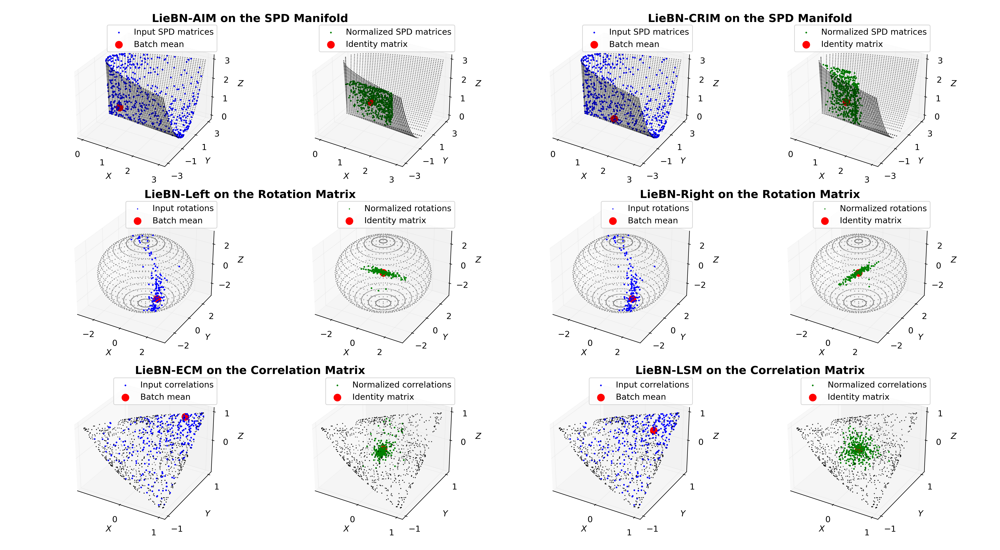
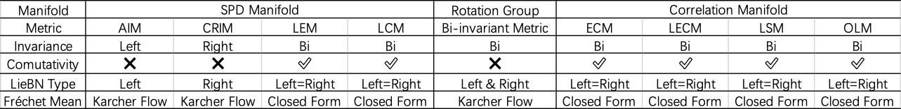

[</img>](https://arxiv.org/abs/2403.11261)
[</img>](https://openreview.net/forum?id=okYdj8Ysru)
[</img>](https://openreview.net/pdf?id=okYdj8Ysru)

# Lie Group Batch Normalization

<div align="center">
    <figure>
        
        <figcaption>Figure 1: Visualization of LieBN on the SPD, rotation, and correlation manifolds.</figcaption>
    </figure>
</div>

## Introduction
This is the official code for our ICLR 2024 publication: *A Lie Group Approach to Riemannian Batch Normalization*. [[OpenReview](https://openreview.net/forum?id=okYdj8Ysru)].

If you find this project helpful, please consider citing us as follows:

```bib
@inproceedings{chen2024liebn,
    title={A Lie Group Approach to Riemannian Batch Normalization},
    author={Ziheng Chen and Yue Song and Yunmei Liu and Nicu Sebe},
    booktitle={ICLR},
    year={2024},
}
```

If you have any problem, please contact me via ziheng_ch@163.com.

## Implementations
This source code contains LieBN on the following manifold:
- SPD manifolds: Log-Euclidean Metric (LEM), Affine-Invariant Metric (AIM), and Log-Cholesky Metric (LCM), and our proposed Cholesky Right Invariant Metric (CRIM);
- Rotation groups: the canonical bi-invariant metric;
- Full-rank correlation manifolds: Euclidean-Cholesky Metric (ECM), Log-Euclidean-Cholesky Metric (LECM), Off-Log Metric (OLM), and Log-Scaled Metric (LSM).

<div align="center">
    <figure>
        
        <figcaption>Figure 2: Summary of Invariant Metrics.</figcaption>
    </figure>
</div>

**Notes:** 
- By default, LieBN uses `.detach()` (`is_detach=True`) when computing Fréchet statistics on the SPD and rotation matrices, following prior work (SPDNetBN). 
- For the correlation matrix, however, LieBN sets `is_detach=False` by default, as our experiments suggest this yields better results.

## Requirements
Requierments: `torch`, `geoopt`, and `pytorch3d`.

## Demos
Demos of LieBN on different geometries can be found `./demos`:

